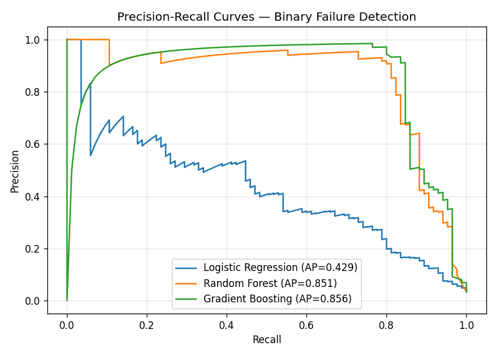

# Predictive Maintenance for Manufacturing Equipment

**[Live demo](https://mason-predictive-maintenance-ml.streamlit.app/)**: runs in the browser, no install required.

End-to-end ML system that flags at-risk machines from real-time sensor
readings, built on the **AI4I 2020 Predictive Maintenance Dataset**
(10,000 cycles, 6 sensor channels, 5 failure modes). Three classifiers are
trained and benchmarked, decision thresholds are tuned for **F2 score**
(weights recall 2× precision to reflect the operational cost asymmetry :
missing a failure is worse than raising a false alarm), and the entire
pipeline is exposed through three layers:

1. A **Python module** (`predictive_maintenance.py`): load, engineer
   features, train, evaluate, run per-failure-mode breakdown.
2. A **walkthrough notebook** (`predictive_maintenance.ipynb`): narrative
   + figures for the full pipeline.
3. An **interactive Streamlit dashboard** (`predictive_maintenance_app.py`):
   adjust sensor sliders to score a live machine cycle, sweep one feature
   to see the failure-probability response, view test-set performance, and
   batch-score uploaded CSVs.



## The data

| Sensor channel | Range |
|---|---|
| Air temperature | 295 – 305 K |
| Process temperature | 305 – 315 K |
| Rotational speed | 1,168 – 2,886 rpm |
| Torque | 3.8 – 76.6 Nm |
| Tool wear | 0 – 253 min |
| Product quality variant | L (60 %) / M (30 %) / H (10 %) |

10,000 cycles total; **3.4 %** carry a failure flag. Five disjoint failure
modes: **TWF** (tool wear), **HDF** (heat dissipation), **PWF** (power),
**OSF** (overstrain), **RNF** (random).

## Feature engineering

On top of the 6 raw channels we derive 4 physics-informed features:

| Feature | Formula | Why |
|---|---|---|
| `temp_diff` | process − air | heat dissipation mechanism |
| `power_proxy` | ω · τ · 2π/60 | motor power = rot × torque |
| `wear_torque` | wear × torque | overstrain driver |
| `rpm_per_torque` | rpm / torque | operating regime |

## Results (held-out 2,500-row test split)

| Model | ROC-AUC | PR-AUC | Recall @ F2-opt | Precision @ F2-opt |
|---|---|---|---|---|
| Logistic Regression | 0.926 | 0.429 | 0.729 | 0.318 |
| Random Forest | 0.975 | 0.851 | 0.824 | 0.854 |
| **Gradient Boosting** | **0.981** | **0.856** | **0.847** | **0.911** |

Gradient Boosting catches **85 % of true failures with fewer than 1-in-10
false alarms** at its tuned threshold.

### Per-failure-mode predictability

| Mode | Description | PR-AUC |
|---|---|---:|
| HDF | Heat dissipation | 0.98 |
| PWF | Power | 1.00 |
| OSF | Overstrain | 0.98 |
| TWF | Tool wear | 0.08 |
| RNF | Random failure | 0.01 |

Three failure modes are *deterministic functions* of the sensor data :
near-perfect detection. TWF and RNF aren't predictable from the available
sensors; that's a useful **negative** signal for capex decisions on
additional instrumentation.

## Repository layout

```
.
├── predictive_maintenance.ipynb        ← walkthrough notebook (narrative + viz)
├── predictive_maintenance.py           ← training + evaluation library
├── predictive_maintenance_app.py       ← Streamlit dashboard
├── ai4i2020.csv                        ← raw dataset
├── model_comparison.csv                ← evaluation metrics
├── per_mode_results.csv                ← per-failure-mode PR-AUC
├── pr_curves.png, confusion_rf.png,
│   feature_importance.png              ← figures from the pipeline
├── requirements.txt
└── README.md
```

## Run it

### Notebook walkthrough

```bash
pip install -r requirements.txt
jupyter notebook predictive_maintenance.ipynb
```

### Interactive dashboard

```bash
streamlit run predictive_maintenance_app.py
```

The dashboard:

- **Live prediction:** slide each sensor to a target value; see all three
  classifiers' failure probabilities update in real time, plus an
  alert banner that turns red when the highest probability crosses your
  configurable threshold.
- **What-if sweep:** pick one feature, hold the rest fixed, plot how each
  classifier's `P(failure)` responds across the feature's full range.
- **Model performance:** PR curves, confusion matrices, and feature
  importance computed on the test split.
- **Per-failure-mode:** bar chart and table showing which modes are
  learnable from the existing sensors.
- **Batch scoring:** upload a sensor-readings CSV, get scored predictions
  for all three models, download the result.

### Programmatic use

```python
from predictive_maintenance import load_data, engineer_features, get_feature_matrix, train_and_evaluate
from sklearn.model_selection import train_test_split

df = load_data("ai4i2020.csv")
X, y, names = get_feature_matrix(engineer_features(df))
X_tr, X_te, y_tr, y_te = train_test_split(X, y, test_size=0.25, stratify=y, random_state=42)
results, fitted = train_and_evaluate(X_tr, X_te, y_tr, y_te, names)
print(results)
```

### Docker

The dashboard is fully containerised. Build and run locally:

```bash
docker build -t predictive-maintenance-ml .
docker run --rm -p 8501:8501 predictive-maintenance-ml
# open http://localhost:8501
```

A multi-stage build (`python:3.13-slim` base) produces a ~600 MB image
running as a non-root user with a Streamlit health-check probe configured.

A GitHub Actions workflow (`.github/workflows/docker.yml`) builds and
pushes the image to **GitHub Container Registry** on every commit to
`main`, tagged `latest` plus a short SHA. Pull and run the published
image:

```bash
docker pull ghcr.io/masonsau0/predictive-maintenance-ml:latest
docker run --rm -p 8501:8501 ghcr.io/masonsau0/predictive-maintenance-ml:latest
```

## Stack

Python · scikit-learn · pandas · NumPy · matplotlib · seaborn ·
**Streamlit** (dashboard) · **Docker** + **GitHub Actions** (containerised
build + automated publish to GHCR)
